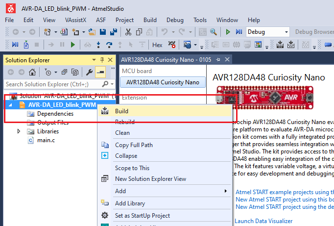
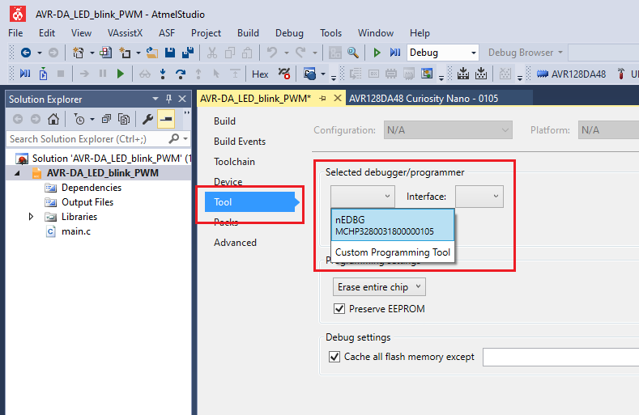

# AVR128DA48 LED Blink using PWM Code Example

This repository provides an Atmel Studio solution with a bare metal code example for an LED blink driven by a PWM signal. The example demonstrates the basic functionality of the PWM peripheral. The output waveform is connected to the on-board LED. The PWM duty cycle value is set at 50%. For half of the period the LED is turned ON, and for the other half the LED is turned OFF.

## Related Documentation
More details and code examples on the AVR128DA48 can be found at the following links:
- [AVR128DA48 Product Page](https://www.microchip.com/wwwproducts/en/AVR128DA28)
- [AVR128DA48 Code Examples on GitHub](https://github.com/microchip-pic-avr-examples?q=avr128da48)
- [AVR128DA48 Project Examples in START](https://start.atmel.com/#examples/AVR128DA48CuriosityNano)

## Software Used
- Atmel Studio 7.0.2397 or newer [(microchip.com/mplab/avr-support/atmel-studio-7)](https://www.microchip.com/mplab/avr-support/atmel-studio-7)
- AVR-Dx 1.0.18 or newer Device Pack

## Hardware Used
- AVR128DA48 Curiosity Nano [(DM164151)](https://www.microchip.com/Developmenttools/ProductDetails/DM164151)

## Setup
The AVR128DA48 Curiosity Nano Development Board is used as test platform
 

The following configurations must be made for this project:

TCA1:
- Single-slope PWM Mode
- Compare channel 2 enabled
- Input clock 4Mhz divided by 16

|Pin           | Configuration      |
| :----------: | :----------------: |
|PC6 (LED0)    | Digital Output     |

## Operation

1. Open the *AVR-DA_LED_blink_PWM.atsln* solution in Atmel Studio

2. Build the solution: right click on *AVR-DA_LED_blink_PWM* solution and select Build
 

3. Select the AVR128DA48 Curiosity Nano on-board debugger in the *Tool* section of the project settings:
  - Right click on the project and click *Properties*;
  - Click *Tool* tab on the left panel, select the corresponding debugger and save the configuration (Ctrl + S)
 

4. Program the project to the board: select *AVR-DA_LED_blink_PWM* project and click *Start Without Debugging*:
 

Demo:
 

## Summary
The demo shows a basic implementation of the PWM peripheral using Timer/Counter Type A. The output of the PWM is connected to the on-board LED of the AVR128DA48 Curiosity Nano board and a waveform signal is generated.
